# Cryptographic Agility & Post-Quantum Cryptography (PQC)

## 1. Executive Summary & Problem Formulation

> **Source basis:** This document preserves the original six-pillar architecture, systems, operating model, and roadmap supplied for the program. Enhancements marked through the control-plane, lifecycle, dependency-graph, policy, exception, telemetry, and maturity sections are architectural recommendations added to strengthen that source design.


The Cryptographic Agility (Crypto-Agility) Program prepares the enterprise for the transition to Post-Quantum Cryptography (PQC).

A Cryptanalytically Relevant Quantum Computer (CRQC) invalidates legacy asymmetric cryptography (RSA, ECC, Diffie-Hellman) via Shor's algorithm, while reducing the effective security strength of symmetric primitives under Grover's algorithm; the program should therefore evaluate whether the selected symmetric algorithm and parameters provide sufficient security strength for the data's required protection lifetime.

Threat actors currently conduct **Harvest Now, Decrypt Later (HNDL)** attacks against enterprise network perimeters.

### Mosca's Theorem Evaluation

```text
Data Shelf Life (X) + Migration Timeline (Y) > Quantum Threat Horizon (Z)

     10–30+ Years              3–7 Years                 ~2030–2035
          X                         Y                         Z
          └─────────────────────────┴─────────────────────────┘
                              Risk Window
                                   ↓
                    RISK: MIGRATION MAY COMPLETE AFTER THE RELEVANT QUANTUM THREAT HORIZON
```

### Program Design Principle

The architecture treats cryptographic agility as a **continuous enterprise control loop**, not a one-time PQC migration project:

**Discover → Contextualize → Model → Classify → Assess → Govern → Plan → Migrate → Verify → Continuously Monitor**

The program maintains a distinction between:
- **Classical-vulnerable** cryptography — quantum-vulnerable primitives or configurations that require migration planning.
- **Hybrid** cryptography — approved classical + PQC combinations used during transition where supported.
- **PQC** — approved post-quantum mechanisms appropriate to the applicable use case.
- **Exception** — a time-bounded, risk-accepted deviation with an accountable owner and migration/closure date.

PQC algorithm selection is intentionally policy-driven rather than hard-coded to a single implementation. NIST finalized FIPS 203 (ML-KEM), FIPS 204 (ML-DSA), and FIPS 205 (SLH-DSA) in 2024 and selected HQC for standardization in 2025; the program should therefore maintain an algorithm policy registry that can evolve as standards and platform support mature. citeturn0search0turn0search8

### Strategic Design Objectives

1. **Automated Discovery to CBOM** — Generate an automated Cryptography Bill of Materials (CBOM) adhering to the CycloneDX 1.6 specification (`type: "cryptographic-asset"`).
2. **Contextual CMDB Federation** — Programmatically bind discovered cryptographic assets to Application IDs, Business Services, Technical Owners, and Environments hosted in ServiceNow CMDB via REST API.
3. **Elimination of Manual Certificate Uploads** — Transition manual certificate uploads to AWS ACM and Azure Key Vault into automated, zero-touch lifecycle delivery driven by Venafi API.
4. **Shift-Left CI/CD Verification** — Identify and flag non-compliant classical primitives, weak parameters, and unvetted libraries in GitLab CI/CD pipelines before deployment.
5. **Operational Change Alignment** — Retain manual approval gates for Non-Prod and CAB governance for Production releases without introducing unauthorized automated ticket generation.

---

## 2. Enterprise Cryptographic Surface Areas & Domain Grouping

Enterprise cryptographic assets are partitioned into six operational domains reflecting current infrastructure footprints and operational models.

| Domain | AWS & Azure / Multi-Cloud | On-Premises & COLO | SaaS & External Interfaces | Ownership & Operating Model |
|---|---|---|---|---|
| **1. Transport & Network Security** | AWS ALB/NLB, Azure Application Gateway, Direct Connect, ExpressRoute | Core routers, IPSec VPN gateways, F5 BIG-IP, Citrix ADC, internal east-west mTLS | External API endpoints, third-party vendor integrations, webhooks | Cloud & Network Engineering / Application Teams |
| **2. PKI & Machine Identities** | Manual certificate imports to AWS ACM & Azure Key Vault; target is Venafi API push | Microsoft AD CS, local OpenSSL stores, Apache/NGINX/IIS keystores | External CAs such as DigiCert, Let's Encrypt, Sectigo managed via Venafi | Enterprise Security / PKI Operations |
| **3. Identity & Federation** | Entra ID (Azure AD), AWS IAM Identity Center, OIDC federated trust for CI/CD | Active Directory / Kerberos, LDAPS, on-prem SAML IdPs such as Ping and ADFS | Okta, Workday, Salesforce, external OAuth2/OIDC JWT tokens | IAM / Directory Engineering |
| **4. Data-at-Rest & KMS** | AWS KMS (CMKs), S3 SSE-KMS, Azure Key Vault, Azure Storage SSE | Physical HSMs (Thales, nShield), SAN/NAS storage, Oracle/SQL TDE | Salesforce Shield, Snowflake CMK, ServiceNow DB encryption | Cloud SecOps / Database Administrators |
| **5. Software Supply Chain** | AWS ECR, Azure ACR, GitLab CI runners, container image signing | Internal Artifactory/Nexus, internal container registries, build agents | Vendor-delivered container base images, public registry dependencies | DevSecOps & Application Engineering |
| **6. Custom Applications** | Microservices on EKS/ECS/AKS, AWS Lambda, Azure Functions | Monoliths, Java JCE, C++ OpenSSL runtimes, hard-coded certs/keys | Payment processors (Stripe, Adyen), B2B file exchanges (SFTP/AS2) | Distributed Application Teams (ServiceNow mapped) |

> **Scope note:** CloudFront is explicitly excluded from the source architecture.

---

# 3. End-to-End System Architecture

The architecture retains the original four operational tiers and adds an enterprise **Cryptographic Control Plane** across them.

The resulting architecture has five logical planes:
1. **Discovery Plane** — sensors, scanners, runtime telemetry, SaaS/vendor evidence.
2. **Cryptographic Data Plane** — normalized CycloneDX 1.6 CBOM, ServiceNow CMDB context, CBOM data lake, and dependency graph.
3. **Cryptographic Control Plane** — policy, classification, risk, PQC readiness, exception management, migration planning.
4. **Remediation Plane** — Venafi, Keyfactor Command, GitLab policy gates, and application crypto-abstraction patterns.
5. **Governance & Evidence Plane** — approvals, CAB alignment, audit evidence, metrics, lineage, and reporting.

CycloneDX v1.6 supports CBOM and representation of cryptographic assets and their relationships, making it a suitable machine-readable foundation for this model. citeturn0search12turn0search14

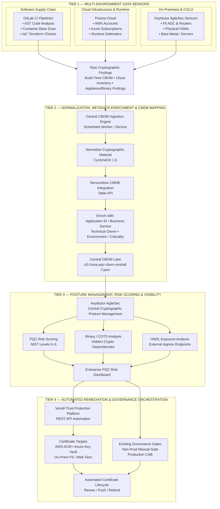

## 3A. Target Cryptographic Control Plane

The control plane is the principal enhancement to the original design. It prevents the architecture from becoming only an inventory and remediation pipeline.

```mermaid
flowchart LR
    DISC["DISCOVER<br/>Prisma • AgileSec • GitLab<br/>TLS Telemetry • VRM"]
    CBOM["MODEL<br/>CycloneDX 1.6 CBOM<br/>Crypto Dependency Graph"]
    CMDB["CONTEXTUALIZE<br/>ServiceNow CMDB<br/>Owner • App • Service • Environment"]
    POLICY["POLICY ENGINE<br/>Approved Algorithms<br/>TLS • Key • Cert • PQC Rules"]
    CLASS["CLASSIFY<br/>Classical-Vulnerable<br/>Hybrid • PQC • Exception"]
    RISK["RISK ENGINE<br/>Exposure • Data Shelf Life<br/>HNDL • Criticality • Confidence"]
    PLAN["MIGRATION PLANNER<br/>Wave • Dependency<br/>Target Pattern • Due Date"]
    EX["EXCEPTION MANAGEMENT<br/>Justification • Compensating Control<br/>Owner • Expiration"]
    REM["REMEDIATE<br/>Venafi • Keyfactor<br/>GitLab • Application Pattern"]
    VERIFY["VERIFY<br/>Rescan • Runtime Telemetry<br/>Evidence • Closure"]
    MON["CONTINUOUS MONITORING<br/>Drift • New Assets • New Findings"]

    DISC --> CBOM --> CMDB --> POLICY --> CLASS --> RISK --> PLAN --> REM --> VERIFY --> MON
    CLASS --> EX
    EX --> RISK
    VERIFY --> CBOM
    MON --> DISC
```

### Control-Plane Responsibilities

| Capability | Purpose | Primary System of Record |
|---|---|---|
| Crypto Policy Registry | Algorithms, protocols, key sizes, certificate rules, PQC requirements, deadlines | Program repository / policy service |
| Crypto Asset Registry | Normalized cryptographic assets | CycloneDX 1.6 CBOM |
| Business Context | Application, service, owner, environment, criticality | ServiceNow CMDB |
| Dependency Graph | Relationships among applications, protocols, libraries, keys, certificates and endpoints | CBOM graph / graph-capable data store |
| Risk & PQC Readiness | Exposure, data lifetime, HNDL, migration complexity, confidence | Risk service / AgileSec integration |
| Exception Management | Time-bounded deviations and compensating controls | ServiceNow |
| Migration Planning | Waves, target architecture, dependencies, due dates | ServiceNow / program planning |
| Evidence & Lineage | Sensor evidence, validation history, approvals, remediation proof | CBOM lake + ServiceNow |

### Architecture Flow

1. **Sensors** discover cryptographic material across cloud, software supply chain, runtime, on-premises, and COLO environments.
2. The **Central CBOM Ingestion Engine** normalizes findings into CycloneDX 1.6.
3. **ServiceNow CMDB** enriches each cryptographic asset with application and ownership context.
4. Enriched CBOMs are persisted in the **central S3 CBOM lake**.
5. **Keyfactor AgileSec** provides centralized cryptographic posture management, binary analysis, PQC risk scoring, and HNDL visibility.
6. Remediation is orchestrated through **Venafi** and existing change-control gates.
7. Existing Non-Prod manual approval and Production CAB governance remain intact.

---

# 4. Architectural Pillar Specifications

## Pillar 1 — Hybrid Multi-Cloud Harvesting & ServiceNow CMDB Enrichment

To achieve complete discovery without maintaining custom Lambdas or Azure Functions across dozens of spoke Landing Zone accounts, cloud-native discovery is routed through Prisma Cloud and synchronized centrally with ServiceNow CMDB.

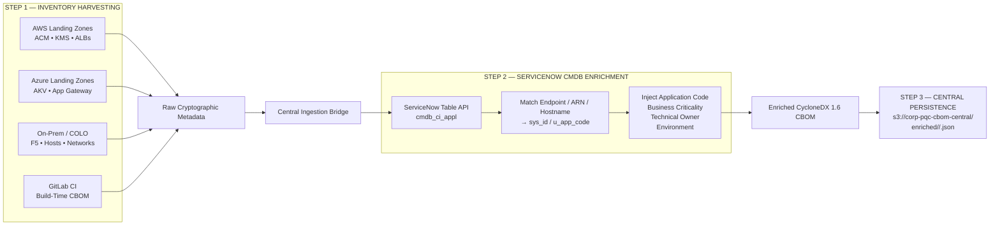

### Enriched CycloneDX 1.6 CBOM

Each discovered component correlates raw cryptographic attributes with ownership and environmental metadata.

```json
{
  "$schema": "http://cyclonedx.org/schema/bom-1.6.schema.json",
  "bomFormat": "CycloneDX",
  "specVersion": "1.6",
  "serialNumber": "urn:uuid:8b3e5124-612a-48ce-932d-202610020854",
  "version": 1,
  "metadata": {
    "timestamp": "2026-10-02T08:54:00Z",
    "component": {
      "type": "application",
      "name": "Treasury-Settlement-Engine",
      "properties": [
        { "name": "servicenow:sys_id", "value": "a3b890f12c45d6e7f8" },
        { "name": "servicenow:u_app_code", "value": "APP-04821" },
        { "name": "servicenow:owned_by", "value": "appteam-treasury@corp.internal" },
        { "name": "servicenow:environment", "value": "Production" },
        { "name": "servicenow:criticality", "value": "Tier-1-Mission-Critical" }
      ]
    }
  },
  "components": [
    {
      "type": "cryptographic-asset",
      "bom-ref": "arn:aws:acm:us-east-1:123456789012:certificate/34ef67ab-90cd",
      "name": "treasury.api.enterprise.com",
      "cryptoProperties": {
        "assetType": "certificate",
        "certificateProperties": {
          "subjectName": "CN=treasury.api.enterprise.com",
          "issuerName": "CN=DigiCert Global G2 TLS RSA SHA256 2020 CA1",
          "notValidAfter": "2027-01-15T23:59:59Z"
        },
        "algorithmProperties": {
          "primitive": "signature",
          "parameterSetIdentifier": "RSA-2048",
          "classicalSecurityLevel": 112,
          "nistQuantumSecurityLevel": 0
        }
      }
    }
  ]
}
```

---

## Pillar 1A — Cryptographic Asset Lifecycle

Every cryptographic asset should have an explicit lifecycle state. This prevents “inventory complete” from being mistaken for “migration complete.”

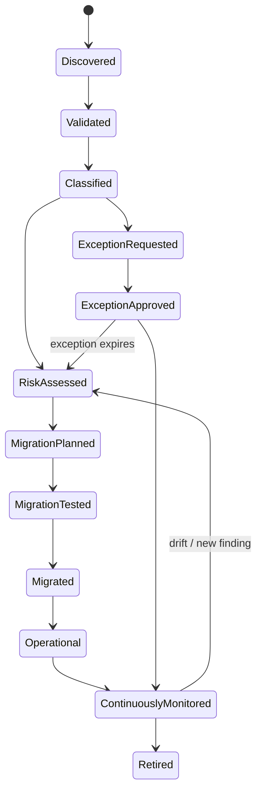

### Required Evidence at Each State

| State | Minimum Evidence |
|---|---|
| Discovered | Source sensor, timestamp, asset identifier |
| Validated | Corroborating evidence or validation result |
| Classified | Algorithm/protocol/type and classical/hybrid/PQC state |
| Risk Assessed | Business criticality, data shelf life, exposure, confidence |
| Migration Planned | Target pattern, owner, wave, due date |
| Migration Tested | Test result, compatibility evidence |
| Migrated | Change record, deployment evidence |
| Operational | Runtime observation and certificate/key status |
| Continuously Monitored | Latest observation and drift status |
| Retired | Decommissioning evidence |

## Pillar 1B — Cryptographic Dependency Graph

A flat CBOM identifies assets; the dependency graph explains **why an asset matters**.

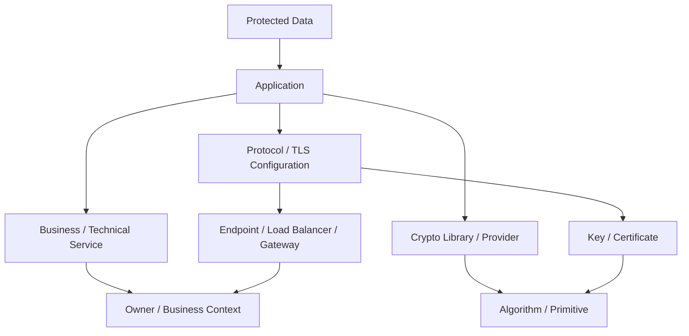

### Recommended Dependency Attributes

- `assetId`
- `parentAssetId`
- `relationshipType`
- `applicationId`
- `businessServiceId`
- `environment`
- `owner`
- `algorithm`
- `keySize`
- `protocol`
- `certificate`
- `endpoint`
- `discoverySource`
- `discoveryTimestamp`
- `lastObserved`
- `lastValidated`
- `confidence`
- `evidenceReference`
- `pqcState`
- `policyState`
- `exceptionId`

## Pillar 2 — Transitioning Manual Certificate Operations to Venafi Automation

Manual certificate uploads into AWS ACM, Azure Key Vault, and on-premises endpoints create operational drag and fail under shortened certificate validity windows. Venafi Trust Protection Platform (TPP) automates lifecycle delivery across cloud endpoints through APIs.

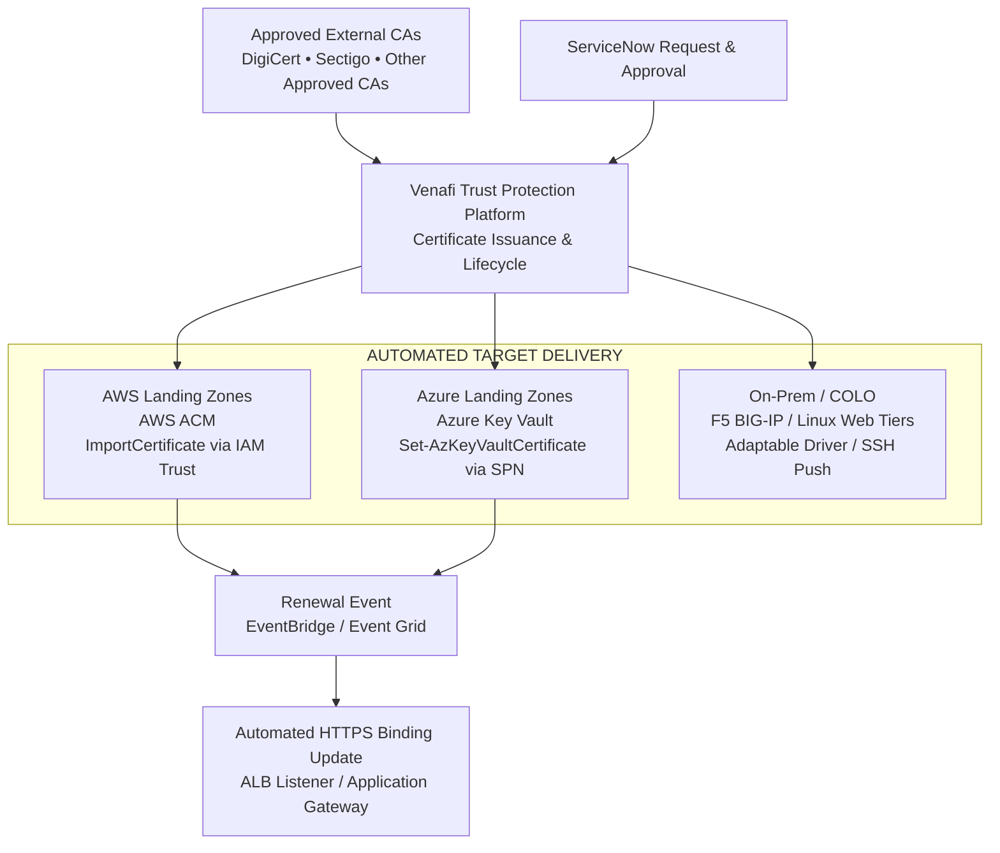

### Certificate Automation Controls

1. **Eliminate console uploads** — Revoke console upload permissions (`acm:ImportCertificate`) from IAM users and Azure roles; restrict import privileges to the central Venafi service principal and IAM automation role.
2. **Automate load balancer re-binding** — When Venafi imports a renewed certificate, EventBridge / Event Grid triggers update of the respective ALB listener or Application Gateway HTTPS binding with zero downtime.
3. **Application team self-service** — Application teams submit certificate requests through ServiceNow. Once approved, ServiceNow triggers Venafi via API to mint and push the certificate to the target environment.

---

## Pillar 3 — Deployment-Time Scanning & Existing Change Management Alignment

Cryptographic checks are embedded into GitLab CI pipelines while preserving existing approval models: manual gates in Non-Prod and CAB governance for Production.

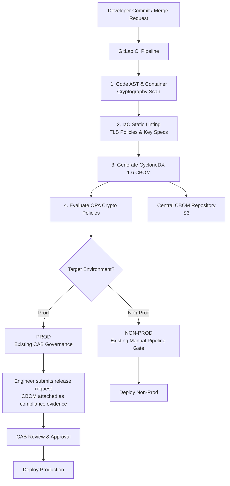

### GitLab CI Scan & Policy Gate Template

```yaml
stages:
  - build
  - test
  - crypto-scan
  - deploy-nonprod
  - deploy-prod

variables:
  CBOM_REPORT: "target/reports/cyclonedx-cbom.json"
  CENTRAL_CBOM_S3: "s3://corp-pqc-cbom-central/build-time"

pqc_cryptography_scan:
  stage: crypto-scan
  image: registry.corp.internal/secops/crypto-scanner:2.4
  script:
    # 1. Run static source analysis and container layer scan
    - cbom-cli scan --source . --format cyclonedx-1.6 --output ${CBOM_REPORT}

    # 2. Evaluate against local OPA rules
    - opa eval --data .security/pqc_policy.rego --input ${CBOM_REPORT}
      "data.crypto.pqc.deny" > eval_result.json

    # 3. Upload CBOM to central repository tagged with commit and branch metadata
    - aws s3 cp ${CBOM_REPORT}
      ${CENTRAL_CBOM_S3}/${CI_PROJECT_PATH}/${CI_COMMIT_REF_SLUG}/${CI_COMMIT_SHORT_SHA}.json

  artifacts:
    reports:
      cyclonedx: ${CBOM_REPORT}
    paths:
      - ${CBOM_REPORT}
    expire_in: 30 days

gate_non_production:
  stage: deploy-nonprod
  script:
    - echo "Executing Non-Prod deployment..."
  when: manual

gate_production:
  stage: deploy-prod
  script:
    - echo "Executing Production deployment post-CAB approval..."
  when: manual
```

---

## Pillar 4 — Telemetry Ingestion Without CloudFront

Because public and internal ingress endpoints terminate on AWS Application Load Balancers (ALBs) and Azure Application Gateways, runtime network telemetry collection focuses on these ingress tiers.

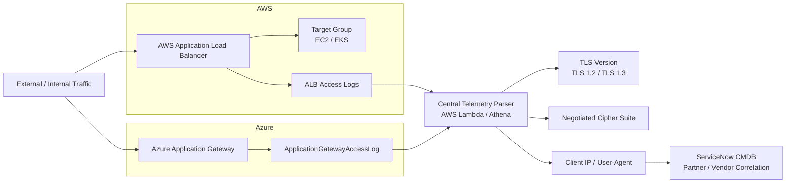

### Enhanced Handshake Telemetry Model

The original telemetry should be expanded beyond TLS version and cipher suite. TLS 1.3 cipher-suite names do not by themselves describe all negotiated cryptographic properties.

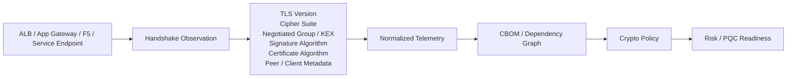

Where platform telemetry does not expose a field, record **Not Observed** rather than inferring it.

### Telemetry Controls

1. Configure all public and private AWS ALBs to write access logs to a central security bucket every five minutes.
2. Configure Azure Application Gateway Diagnostic Settings to stream `ApplicationGatewayAccessLog` to Azure Event Hub or a central Log Analytics workspace.
3. Extract:
   - **Client TLS Version** — flag obsolete TLS 1.0/1.1 traffic and baseline TLS 1.2 versus TLS 1.3 adoption.
   - **Negotiated Cipher Suite** — detect non-PQC-safe handshakes vulnerable to HNDL.
   - **Client IP & User-Agent** — correlate with ServiceNow CMDB partner records to identify external vendors requiring PQC support outreach.

---

## Pillar 5 — Role & Integration of Keyfactor AgileSec

Keyfactor AgileSec sits at the center of the architecture as the specialized Cryptographic Posture Management (CPM) engine.

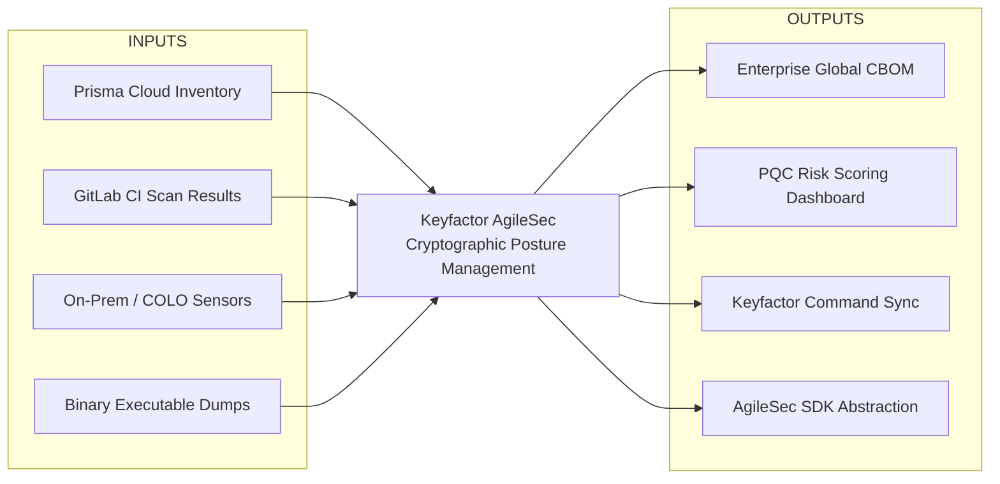

### AgileSec Responsibilities

1. **Deep binary & firmware dissection** — Prisma and GitLab analyze package manifests and source AST; AgileSec deconstructs compiled binaries (`.so`, `.dll`, `.jar`), embedded firmware, and COTS software to locate hard-coded cryptographic algorithms, static keys, and hidden dependencies.
2. **PQC risk scoring & lifecycle mapping** — AgileSec maps discovered assets to NIST PQC security levels:
   - **Classical-vulnerable** — Quantum-vulnerable primitives (for example RSA, ECC, and DH) that require migration planning under the enterprise crypto policy.
   - **NIST Levels 1/3/5** — Standardized PQC primitives including FIPS 203 ML-KEM, FIPS 204 ML-DSA, and FIPS 205 SLH-DSA.
3. **Orchestrated remediation via Keyfactor Command** — When AgileSec identifies expiring certificates or non-compliant algorithms, it drives automated renewals through Keyfactor Command to IIS, Apache, F5, AWS ACM, and Azure Key Vault.
4. **AgileSec SDK cryptographic abstraction** — Development teams use unified cryptographic wrapper libraries instead of hard-coding JCE or OpenSSL primitives, allowing applications to shift from classical to post-quantum algorithms through centralized configuration updates without application rewrites.

---

## Pillar 6 — SaaS Vendor Governance via ServiceNow VRM

SaaS infrastructure cannot be directly scanned with AST analyzers or cloud posture tools. Governance therefore operates through structured vendor risk workflows.

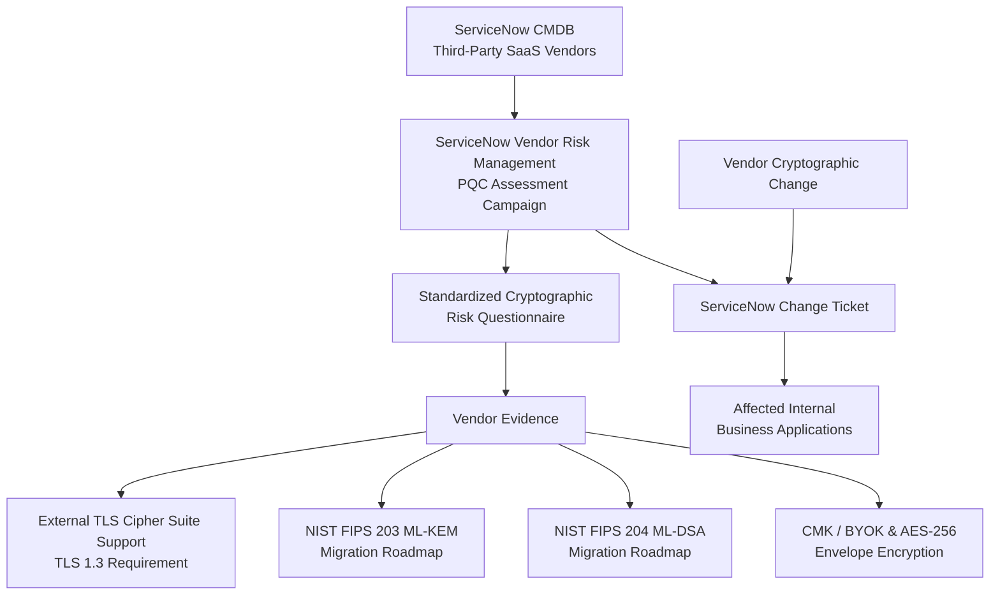

### SaaS Governance Controls

- Ingest all third-party SaaS vendors tracked in the CMDB into a dedicated PQC assessment campaign.
- Issue standardized vendor assessments covering TLS 1.3, FIPS 203 ML-KEM, FIPS 204 ML-DSA, CMK/BYOK, and AES-256 envelope encryption capabilities.
- Route vendor-announced cryptographic changes, such as older TLS cipher deprecation or root CA rotation, through standard ServiceNow change tickets mapped to affected internal applications.

---

# 4A. Policy, Exception & Governance Model

## Crypto Policy Engine

The policy engine should be the authoritative decision point for cryptographic requirements. It should not be embedded only inside a vendor scanner.

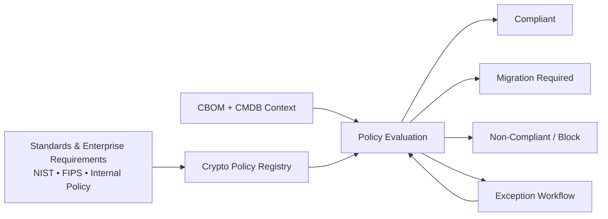

### Policy Categories

| Category | Examples |
|---|---|
| Algorithm | RSA/ECC/DH disposition; approved PQC algorithms; deprecated algorithms |
| Protocol | TLS minimum version; approved cipher suites; key exchange/signature requirements |
| Certificate | Key type, signature algorithm, validity, issuer, renewal window |
| Key Management | KMS/HSM requirements, rotation, import/export restrictions |
| Software | Approved crypto libraries/providers and minimum versions |
| PQC | Classical-vulnerable, hybrid, PQC transition requirements |
| Data | Data shelf life and protection horizon |
| Exception | Required evidence, owner, compensating control, expiration |

## Exception Management

Exceptions are first-class program objects, not comments attached to findings.

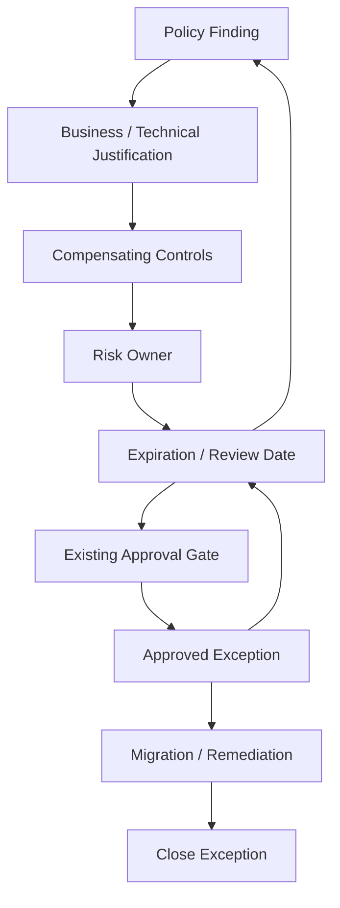

**Required exception fields:** finding, affected asset, policy rule, justification, constraint, compensating control, risk owner, approval, creation date, expiration date, target migration date, remediation plan, and evidence.

## Data Lineage & Evidence

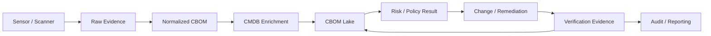

Every finding should retain enough lineage to answer:

**Where was it discovered? When? By what method? What asset did it map to? What policy evaluated it? Who approved the action? What changed? How was closure verified?**

# 5A. Migration Strategy & Program Metrics

## Migration Waves

Migration should be prioritized using transparent criteria rather than a single opaque vendor score.

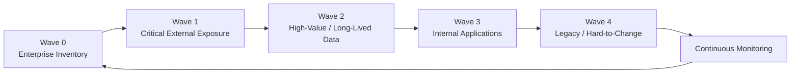

### Suggested PQC Readiness Dimensions

| Dimension | Example Evidence |
|---|---|
| Inventory Coverage | % of known environments/assets represented in CBOM |
| Cryptographic Classification | % classified as classical-vulnerable / hybrid / PQC |
| Context Coverage | % mapped to CMDB application, owner and environment |
| Evidence Confidence | % of findings with validated evidence |
| HNDL Exposure | Long-lived sensitive data using quantum-vulnerable cryptography |
| External Exposure | Internet-facing or partner-facing vulnerable endpoints |
| Migration Readiness | Target pattern and test evidence available |
| Exception Health | Exceptions expiring within threshold |
| Runtime Drift | Assets whose observed state differs from approved state |
| Remediation Verification | % closed only after successful rescan/telemetry |

## Crypto Abstraction Layer

For custom applications, introduce a crypto-provider abstraction where practical:

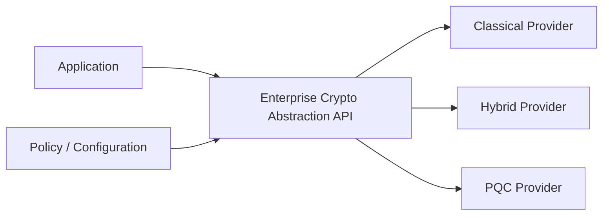

This reduces application coupling to a single cryptographic implementation and supports future provider/algorithm changes without broad application rewrites.


# 6. Implementation Roadmap

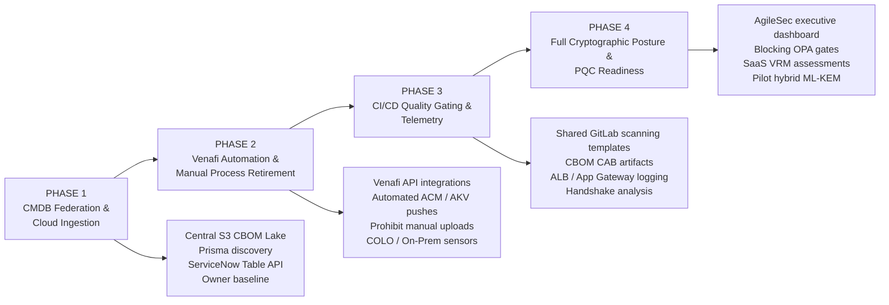

### Phase 1 — CMDB Federation & Cloud Ingestion

- Deploy Central S3 CBOM Lake: `s3://corp-pqc-cbom-central/`
- Configure Prisma Cloud asset discovery across AWS and Azure Landing Zones.
- Implement Central Ingestion Bridge with ServiceNow Table API integration.
- Complete initial baseline mapping of Application Owners to cryptographic endpoints.

### Phase 2 — Venafi Automation & Manual Process Retirement

- Establish Venafi API key integrations with AWS ACM and Azure Key Vault.
- Migrate primary ALB and Azure Application Gateway certificates to automated Venafi pushes.
- Update enterprise policy prohibiting manual certificate console uploads.
- Deploy Keyfactor AgileSec discovery sensors across COLO and On-Premises DMZs.

### Phase 3 — CI/CD Quality Gating & Telemetry

- Publish shared GitLab CI scanning templates with CycloneDX 1.6 output.
- Provide engineers with CBOM reporting artifacts for manual CAB submissions.
- Enable access logging on all AWS ALBs and Azure Application Gateways.
- Configure SIEM log parsers for handshake analysis and cipher tracking.

### Phase 4 — Full Cryptographic Posture & PQC Readiness

- Launch Keyfactor AgileSec executive dashboard correlated with ServiceNow metadata.
- Enforce blocking OPA gates in CI/CD for deprecated algorithms (MD5, SHA1, RSA-1024).
- Initiate ServiceNow VRM assessments for mission-critical SaaS partners.
- Pilot hybrid PQC key encapsulation (ML-KEM) on edge ingress load balancers.

---

# 7. Program Verification & Operational Checklist

| Operational Domain | Current State | Target State | Acceptance Criteria |
|---|---|---|---|
| **Cloud Discovery** | No unified cryptographic inventory. | Prisma Cloud inventory transformed into CycloneDX 1.6 CBOM and enriched via ServiceNow CMDB. | Daily automated CBOM reports stored in S3; 100% of discovered certificates and KMS keys tagged with `u_app_code` and `owned_by`. |
| **Certificate Lifecycle** | Manual certificate uploads to AWS ACM and Azure Key Vault. | Zero manual uploads; certificates pushed automatically via Venafi REST API. | Venafi provisions and rotates certificates on AWS ALBs and Azure Application Gateways with zero console interventions. |
| **On-Prem / COLO** | Managed independently by application teams. | Keyfactor AgileSec sensors scan hosts and appliances; inventory linked to CMDB. | AgileSec central dashboard accounts for on-prem F5s, physical HSMs, and server keystores with clear owner assignment. |
| **CI/CD Quality Gates** | Manual approval gates for non-prod and prod. | GitLab CI scans code and IaC; generates CBOM compliance report for existing CAB reviews. | Application teams generate CBOM artifacts in pipelines and attach them to manual CAB approval submissions. |
| **SaaS Cryptography** | Ticket-driven and unmonitored. | Formalized Vendor Risk Management (VRM) in ServiceNow tracking vendor PQC timelines. | Top 20 critical SaaS providers evaluated for TLS 1.3 support, BYOK capabilities, and NIST PQC migration roadmaps. |

---

# 8. Logical Integration Map

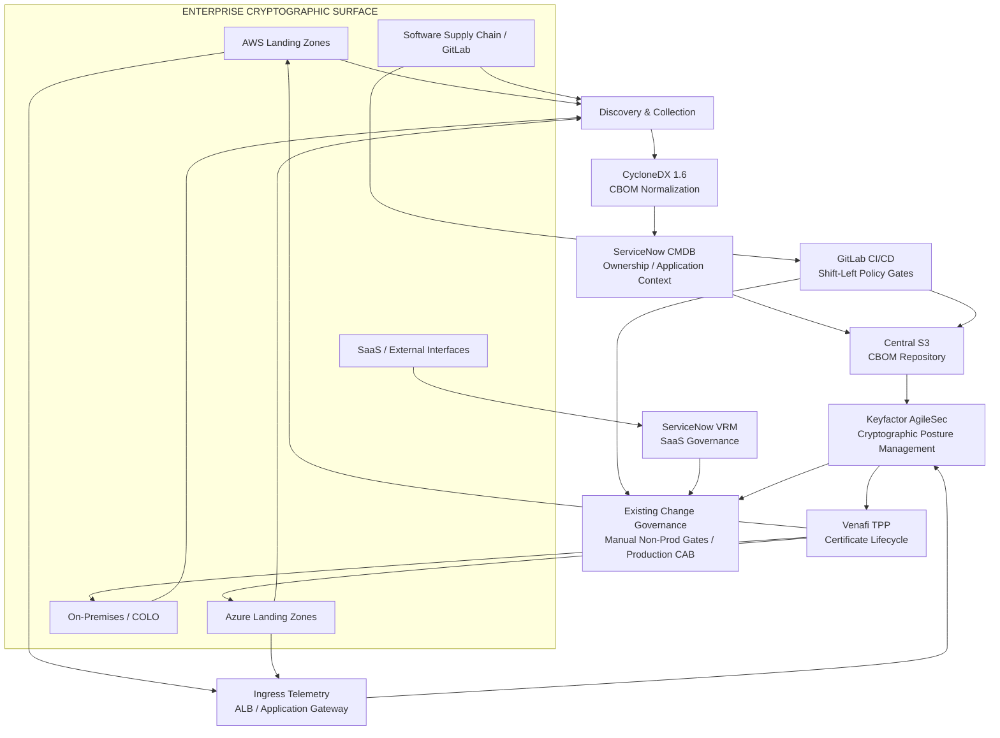

---

# 9. Operating Model Summary

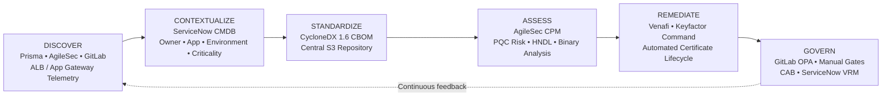

The resulting operating loop is:

**Discover → Contextualize → Standardize → Assess → Remediate → Govern → Continuously Discover**

This architecture preserves the organization's existing governance model while adding centralized cryptographic visibility, standardized CBOM generation, automated certificate lifecycle management, shift-left CI/CD controls, PQC posture scoring, runtime telemetry, and SaaS vendor governance.


# 12. Implementation Acceptance Criteria

The architecture should not be considered operationally complete until the following are demonstrable:

- [ ] All in-scope environments have an identified discovery mechanism.
- [ ] Cryptographic findings are normalized into CycloneDX 1.6 CBOM.
- [ ] CBOM assets retain discovery source, timestamp, confidence, and evidence references.
- [ ] Assets can be mapped to ServiceNow CMDB application/service/owner/environment context.
- [ ] A cryptographic dependency graph can trace an application to its relevant crypto assets.
- [ ] Policy evaluation distinguishes classical-vulnerable, hybrid, PQC, compliant, and exception states.
- [ ] Exceptions have owners, compensating controls, expiration dates, and migration targets.
- [ ] Certificate lifecycle automation identifies the actual orchestration component responsible for rebinding/deployment.
- [ ] GitLab CI can enforce approved cryptographic policy before deployment.
- [ ] Runtime telemetry captures available TLS version, cipher suite, negotiated key exchange/group, signature algorithm, and certificate algorithm.
- [ ] Remediation is verified by rescanning or runtime evidence.
- [ ] Audit evidence preserves end-to-end lineage from discovery through closure.
- [ ] Dashboard metrics are reproducible from authoritative data rather than manually maintained spreadsheets.
- [ ] PQC algorithm selection remains policy-driven and can evolve as standards/platform support change.

# 13. Design Decisions & Open Questions

The following should remain explicit implementation decisions rather than assumptions:

1. **Venafi integration:** confirm exact APIs and supported certificate/key delivery workflows for AWS ACM, Azure Key Vault, F5, Linux and other target stores.
2. **Event orchestration:** identify the concrete workflow/function responsible for certificate rebinding and deployment; event buses should be treated as transport/orchestration components, not as the rebinding executor.
3. **AgileSec integration:** validate the supported ingestion/export/API model and which findings are authoritative versus corroborating evidence.
4. **Prisma integration:** define which inventory and cryptographic findings are consumed and how duplicates are reconciled.
5. **ServiceNow CMDB:** define authoritative CI classes, relationship types, ownership fields, and reconciliation rules.
6. **CBOM storage:** determine whether the CBOM lake requires object storage only or a graph/query layer for dependency analysis.
7. **Policy engine:** decide whether policy is implemented as OPA/Rego, a dedicated service, or a combination.
8. **Runtime telemetry:** document platform-specific fields that are observable and explicitly mark unavailable fields as Not Observed.
9. **PQC transition:** define when hybrid configurations are permitted, required, or prohibited by environment and use case.
10. **Compliance mapping:** map policy controls to the organization's applicable NIST/CIS/FedRAMP/other control catalogues.

# 14. Reference Standards & Guidance

- NIST FIPS 203 — ML-KEM
- NIST FIPS 204 — ML-DSA
- NIST FIPS 205 — SLH-DSA
- NIST SP 800-227 — Recommendations for Key-Encapsulation Mechanisms
- NIST CSWP 39-upd1 — Considerations for Achieving Crypto Agility: Strategies and Practices
- CycloneDX v1.6 — Cryptographic Bill of Materials (CBOM)

**Design note:** NIST finalized FIPS 203/204/205 in August 2024 and selected HQC for standardization in March 2025. CycloneDX v1.6 introduced CBOM support and models cryptographic assets and their relationships. The implementation should maintain a standards watch so policy can evolve without redesigning the architecture. 
